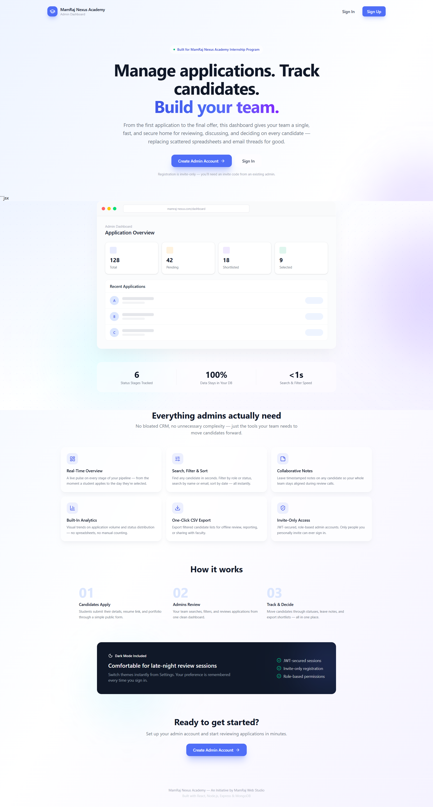
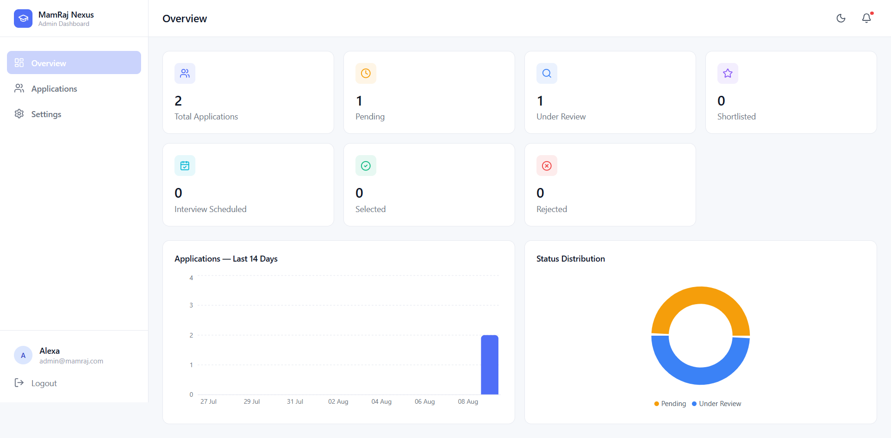
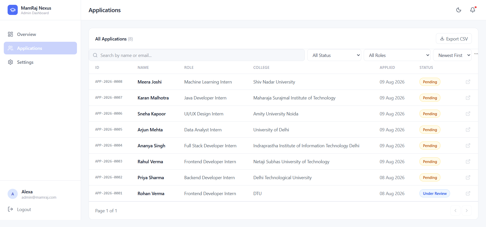

# MamRaj Nexus Academy — Admin Dashboard
 
An admin dashboard built for **MamRaj Nexus Academy** to manage student internship applications — from submission through review to final decision.
 
Built as part of the Technical Interview Task for the Frontend / Full Stack Developer Intern position.
 
**Candidate:** Shambhavi Mishra
 
---
 
## 🔗 Live Links
 
| | URL |
|---|---|
| **Live App (Vercel)** | `https://your-app-name.vercel.app` |
| **Backend API (Render)** | `https://your-server-name.onrender.com` |
| **GitHub Repository** | `https://github.com/ShambhaviMishra07/admin_dashboard` |
 
 
---
 

## 📸 Screenshots

### Landing Page



### Dashboard Overview



### Applications Table



 
---
 
## ✨ Features
 
### Core Requirements (from Task Brief)
 
| Requirement | Status | Notes |
|---|---|---|
| Admin Authentication | ✅ | JWT-based login/logout, protected routes |
| Dashboard Overview | ✅ | Live counts for all 6 statuses + total |
| Applications Table | ✅ | All required fields, clickable rows |
| Search & Filters | ✅ | Search by name/email, filter by status/role, sort by date, reset |
| Student Profile | ✅ | Full detail view with resume/portfolio links, academics, cover letter |
| Status Management | ✅ | Pending → Under Review → Shortlisted → Interview Scheduled → Selected/Rejected |
| Admin Notes | ✅ | Add, edit, delete — timestamped |
| Responsive Design | ✅ | Mobile drawer nav, responsive grids across all breakpoints |
 
### Bonus Features Implemented
 
| Feature | Status | Notes |
|---|---|---|
| Dark Mode | ✅ | Full app-wide toggle, persisted via localStorage |
| Analytics | ✅ | 14-day application trend (bar chart) + status distribution (pie chart), built with Recharts |
| Export CSV | ✅ | Exports current filtered view, not just all data |
| Resume Download | ✅ | Resume/portfolio stored as external links (see Assumptions) |
| Pagination | ✅ | Server-side pagination on the applications table |
| Role-Based Access | ✅ | `super-admin` vs `admin` — deletion and invite code management restricted to super-admin |
| Email Actions | ⭕ | Not implemented — would require a transactional email service (see Future Improvements) |
 
### Additional Features (beyond the brief)
 
- **Public "Apply" page** (`/apply`) — a real application form so the dashboard has an actual intake flow, not just Postman-seeded data.
- **Landing page** — glassmorphism marketing page with feature highlights, product preview, and CTAs into Sign In / Sign Up.
- **Invite-only registration** — signup requires an invite code to prevent unauthorized admin accounts.
- **Database-backed, rotatable invite code** — super-admins can view and regenerate the invite code directly from Settings, so access can be granted (e.g. to a mentor for evaluation) without redeploying.
- **Settings page** — update profile name, change password, toggle dark mode, manage invite code.
---
 
## 🛠 Tech Stack
 
**Frontend**
- React (Vite)
- Tailwind CSS
- Framer Motion (animations)
- Recharts (analytics charts)
- Lucide React (icons)
- React Router
- Axios
**Backend**
- Node.js + Express
- MongoDB + Mongoose
- JWT (jsonwebtoken) for authentication
- bcryptjs for password hashing
**Deployment**
- Frontend: Vercel
- Backend: Render
- Database: MongoDB Atlas
---
 
## 📁 Project Structure
 
```
mamraj-admin-dashboard/
├── client/                      # React frontend
│   └── src/
│       ├── components/
│       │   ├── layout/          # Sidebar, Topbar, DashboardLayout
│       │   ├── dashboard/       # StatCard, charts
│       │   ├── applications/    # StatusBadge, FilterBar
│       │   └── profile/         # StatusDropdown, NotesPanel
│       ├── pages/                # Landing, Login, Signup, Dashboard,
│       │                          # Applications, StudentProfile, Settings, Apply
│       ├── context/              # AuthContext, ThemeContext
│       ├── services/             # api.js, applicationService.js, authService.js
│       └── utils/                # exportCsv.js
└── server/                       # Node/Express backend
    ├── models/                   # Admin.js, Application.js, Settings.js
    ├── controllers/               # authController.js, applicationController.js
    ├── routes/                    # authRoutes.js, applicationRoutes.js
    ├── middleware/                 # authMiddleware.js
    └── config/                     # db.js
```
 
---
 
## 🔑 Environment Variables Reference
 
### `server/.env`
 
| Variable | Description |
|---|---|
| `PORT` | Port the Express server runs on (default: 5000) |
| `MONGO_URI` | MongoDB connection string |
| `JWT_SECRET` | Secret key used to sign JWT tokens |
| `ADMIN_INVITE_CODE` | Bootstrap invite code — used only if no invite code exists yet in the database |
| `CLIENT_URL` | Frontend URL, used for CORS configuration |
 
### `client/.env`
 
| Variable | Description |
|---|---|
| `VITE_API_URL` | Base URL of the backend API |
 
---
 
## 📡 API Reference (Summary)
 
| Method | Endpoint | Access | Description |
|---|---|---|---|
| POST | `/api/auth/register` | Public + invite code | Register new admin |
| POST | `/api/auth/login` | Public | Login |
| GET | `/api/auth/me` | Protected | Get current admin |
| PUT | `/api/auth/profile` | Protected | Update name |
| PUT | `/api/auth/password` | Protected | Change password |
| GET | `/api/auth/invite-code` | Super-admin | View current invite code |
| PUT | `/api/auth/invite-code` | Super-admin | Update invite code |
| GET | `/api/applications` | Protected | List applications (search/filter/sort/paginate) |
| GET | `/api/applications/stats` | Protected | Dashboard overview counts |
| GET | `/api/applications/analytics` | Protected | 14-day application trend |
| POST | `/api/applications` | Public | Submit a new application |
| GET | `/api/applications/:id` | Protected | Get single application |
| PATCH | `/api/applications/:id/status` | Protected | Update status |
| POST | `/api/applications/:id/notes` | Protected | Add note |
| PUT | `/api/applications/:id/notes/:noteId` | Protected | Edit note |
| DELETE | `/api/applications/:id/notes/:noteId` | Protected | Delete note |
| DELETE | `/api/applications/:id` | Super-admin | Delete application |
 
---
 
## 📝 Assumptions Made
 
1. **Resumes and portfolios are external links, not file uploads.** Candidates paste a shareable link (Google Drive, Dropbox, etc.) instead of uploading a file directly. This avoids needing a paid file-storage service and is a common pattern for lightweight internship-tracking tools.
2. **Registration is invite-only.** Since MamRaj Nexus Academy would realistically only have 1–2 admins, open public signup was intentionally restricted with a shared invite code rather than left open to anyone.
3. **Role-based access is minimal but real.** The first-ever registered account automatically becomes `super-admin`; all subsequent accounts are `admin` regardless of what role is requested in the signup payload, preventing privilege escalation. Only `super-admin` can delete applications or manage the invite code.
4. **A public "Apply" page was added** even though not explicitly required, to make the system testable end-to-end without relying on Postman for data entry.
5. **Analytics uses a rolling 14-day window** for the trend chart to keep it readable; this could be made configurable in a future iteration.
---
 
## 🔮 Future Improvements
 
- **Email Actions**: Automated status-change emails to candidates via Nodemailer or a transactional email API (Resend, SendGrid).
- **File upload support**: Direct resume upload (e.g. to Cloudinary or AWS S3) as an alternative to link-based submission.
- **Bulk actions**: Select multiple applications and update status or export in bulk.
- **Audit log**: Track which admin made which status changes and when.
---
 
## 👩‍💻 Author
 
**Shambhavi Mishra**

 